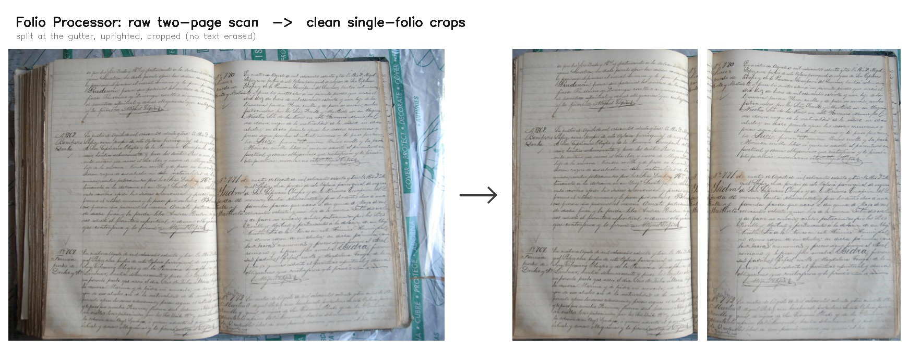

# Folio Processor

Turn raw photographs of bound archival registers into clean, **single-folio,
upright, cropped** page images — one scan in, the corrected page(s) out — as a
desktop app, a local web app, a command-line tool, or at cloud scale.

Built for the [Slave Societies Digital Archive](https://www.slavesocieties.org/)
to pre-process a ~750,000-image corpus ahead of handwritten-text transcription.



---

## Run it as an app — no coding, no LLM

Two ways, depending on whether you want zero setup or GPU speed.

### Option A — download the app (no Python, easiest)

1. Download **[FolioProcessor-win64.zip](../../releases/tag/app-v1)** (Windows).
2. Unzip it and **double-click `FolioProcessor.exe`**.

Your browser opens the **Folio Processor** — drag in page scans, get cropped
single-folio images back, download them as a `.zip`. The first launch downloads the
models (~416 MB) next to the app, then it works offline. Runs on **CPU**
(self-contained; ideal for a few pages or a demo).

### Option B — run from source (uses your GPU, recommended for bulk)

1. Install **Python 3.10+** ([python.org](https://www.python.org/downloads/) — on
   Windows, tick *"Add Python to PATH"*).
2. Download this repo (**Code → Download ZIP**, then unzip) or `git clone` it.
3. **Double-click `Run Folio App.bat`** (Windows) / `run_folio_app.command` (macOS),
   or run `python run_app.py`.

The launcher installs what's missing and opens the same web app. **It uses your GPU
automatically** — it detects an NVIDIA GPU and installs a CUDA build of PyTorch (much
faster for large batches); with no GPU it installs the CPU build, and an existing torch
is reused untouched. (50-series / Blackwell GPUs: `FOLIO_TORCH_INDEX=cu128 python run_app.py`.)

## Three ways to run it

| | Command | Best for |
|---|---|---|
| **Web app** | `folio-web` (or `Run Folio App.bat`) | drag-and-drop in a browser; also runs headless on a server (`--host 0.0.0.0`) |
| **Desktop app** | `folio-gui` (or `Folio Processor.bat`) | offline drag-and-drop on one machine |
| **Command line** | `folio scan.jpg` · `folio ./folder --out ./out --jobs 8` | batches, scripting, automation |

At cloud scale it streams straight through S3:

```bash
folio s3://raw-bucket/volume/ --out s3://crops-bucket/ --jobs 16
```

## What it does

For every scan the pipeline:

1. **Counts** folios — one page, a two-page spread, or reject.
2. **Segments** the page with a learned U-Net mask (works on light-on-light and
   frayed pages the classical detector can't).
3. **Splits** two-folio spreads at the true (possibly curved) spine via seam-energy
   detection — never a fixed midpoint.
4. **Crops** each folio at full resolution with a margin, so marginalia is kept.
5. **Uprights** it — a 4-way (0/90/180/270) classifier plus fine deskew, with an
   independent OCR "up/down" rescue for the hard 180° cases.
6. **Writes** the upright crop plus a JSON provenance sidecar (its exact location in
   the original image); low-confidence pages are flagged for review.

### Cropping: tight bounding box (default) vs. white-out

The crop is the first stage of a pipeline whose last stage is *paid* transcription,
so anything it removes is text lost forever. The default is therefore the safe one:

- **Approach B — tight crop (default).** Crops to the folio's bounding box and keeps
  the natural background. It **alters no pixel** — only tightens the rectangle — so it
  *cannot* erase text, while the facing page/binding fall outside the crop. Verified at
  **0 px of folio-text loss** across the evaluation set.
- **Approach A — white-out** (`--white-out`). Blanks the background to white for the
  cleanest input, but can over-crop faded/damaged pages. Use when you trust the
  segmenter on your material.

## Accuracy

Measured on held-out labelled data:

| Stage | Result |
|---|---|
| Folio count (one/two/reject) | 100% |
| Two-folio split | 100% |
| Orientation (4-way + deskew) | 98.8% in-distribution; OCR rescue corrects hard 180° flips |
| Learned page segmentation | val IoU 0.96 |
| Folio-text preservation (approach B) | **0 px lost** |

## Model weights

Weights are published as a **[GitHub Release](../../releases/tag/weights-v1)** (too
large for git). The launcher fetches them automatically; to do it manually:

```bash
python tools/fetch_weights.py     # ~416 MB into weights/
```

The pipeline is **inference-only** — the four weights (page segmenter, orientation,
count, blank classifier) are frozen and reused for every image; nothing is retrained
at run time.

## For developers

```bash
git clone https://github.com/slavesocieties/ssda-folio-pipeline
cd ssda-folio-pipeline
pip install -e . --no-deps        # the `folio`, `folio-gui`, `folio-web` commands
pip install -r requirements.txt   # core deps
pip install -r requirements-web.txt   # (optional) web app
python tools/fetch_weights.py
pytest -q                         # 64 tests, CPU-only, no weights needed
```

```
folio/
  cli.py            command-line entry point
  webapp.py         local web app (folio-web)
  gui.py            desktop app (folio-gui)
  process.py        pipeline builder + local/S3 runners
  pipeline.py       per-image orchestration
  config.py         typed configuration
  stages/           spine split, geometry, orientation, OCR orient-rescue
  models/           learned segmentation + classifier wrappers
  training/         self-supervised orientation + count/segmentation training
tools/              weight fetch, provenance export, evaluation, verification
scripts/            crop → Archivault transcription workflow (see scripts/README.md)
docs/               ARCHITECTURE.md, DEPLOY.md, metrics
```

Full design rationale and per-stage math: **[ARCHITECTURE.md](ARCHITECTURE.md)**.
End-user tool guide: **[README_TOOL.md](README_TOOL.md)**. Cloud deployment:
**[docs/DEPLOY.md](docs/DEPLOY.md)**.
