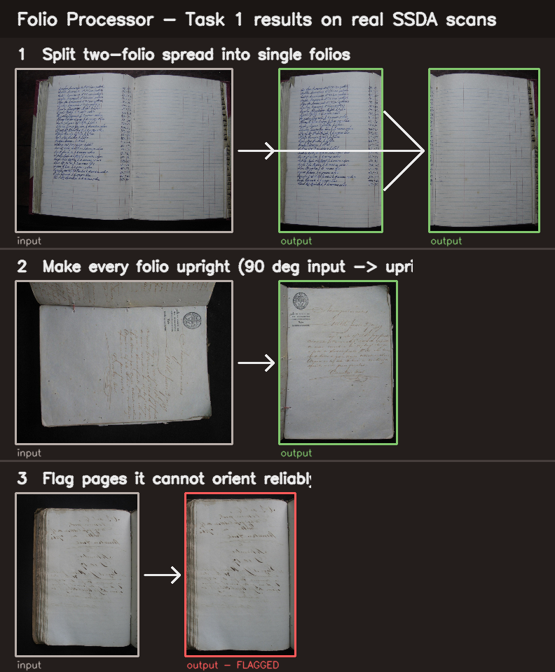

# Folio Processor — summary

A tool that turns **any** SSDA scan into clean **single-folio, upright, cropped**
page images. It implements Task 1 (split two-folio spreads, make every folio
upright, crop to the folio) and runs on one image, a folder, or the full S3
corpus.

## How to use it
- **Desktop app:** `folio-gui` — drag scans onto the window, press Process, get
  thumbnails (pages it's unsure about are outlined in red).
- **Command line:** `folio page.jpg` · `folio /scans --out /out --jobs 6`
- **Whole corpus (S3):** `folio s3://ssda-raw/v/ --out s3://ssda-folios/f/`

Outputs: `folios/` (the crops), `sidecars/` (per-image JSON provenance),
`review/` (auto-flagged for a human glance), `manifest.csv`.

## What it does well (measured)
- **Split:** 7/7 two-folio spreads split correctly; all outputs portrait. Uses a
  dynamic seam/gutter split, not a fixed midpoint.
- **Count head:** **100%** on a 126-image held-out test.
- **Orientation head:** **98.3%** held-out; 4-way (handles the landscape volumes
  via an orient-before-segment pre-pass), plus an adaptive deskew that matches an
  exhaustive search exactly and never rails.
- **Robust:** auto-discovers weights, auto-selects GPU/CPU, falls back to a
  no-weights classical mode, one bad image never kills a run.
- **Scales:** ~0.5 s/image; ~18 h for 750k at 6× parallel (no cloud strictly needed).

## Honest limitations
- **Sparse/near-blank pages** can be confidently mis-oriented (both our model and
  the legacy one make the same 180° mistake; no confidence signal catches it).
  The tool **flags these for review** rather than shipping them silently — but it
  cannot always *correct* them. The real fix is a small **labelled up/down set**.
- The `reject` (non-page) class isn't trained — every input yields folio(s).
- Held-out numbers are from the same volumes as training; the truest signal is the
  cross-source result on the 25 sample scans (see `METRICS.md`).

## What I need from you
1. A **labelled validation set** (a few hundred scans with ground-truth count +
   orientation, ideally spanning the `landscape_volumes` and some sparse pages) so
   we can (a) report real corpus accuracy and (b) supervised-fine-tune away the
   sparse-page orientation errors and re-tune the review threshold.
2. The **run target** decision: laptop multi-day vs. a cloud GPU burst (the
   benchmark says the laptop is viable).

See `README_TOOL.md` (usage), `METRICS.md` (numbers + how to reproduce),
`ARCHITECTURE.md` (design).
